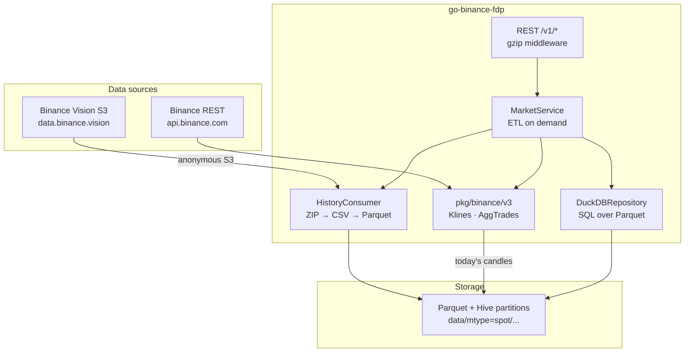
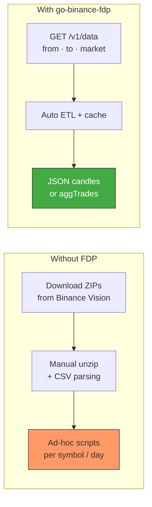
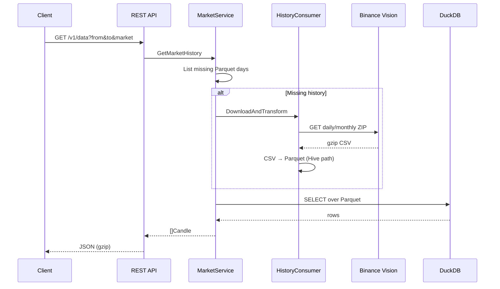

# go-binance-fdp

[](https://pkg.go.dev/github.com/eslider/go-binance-fdp)
[](https://opensource.org/licenses/MIT)
[](https://go.dev)
[](https://github.com/eSlider/go-binance-fdp/stargazers)

Go **finance data proxy** for Binance spot market data: download historical klines and aggregate trades from [Binance public data](https://data.binance.vision/), cache them as Hive-partitioned Parquet, query with DuckDB, and serve a gzip-compressed REST API. No API keys required for historical S3 data.

Pairs with [go-trade](https://github.com/eSlider/go-trade) for a unified cross-exchange market data model.

## Architecture



## The Problem: Raw Files vs. Queryable History



**Without a proxy:** You manage S3 paths, daily ZIP layouts, decompression, schema mapping, and missing “today” data yourself.

**With FDP:** Request a time range; the service fetches missing Parquet from S3 (or live API for the current day), runs DuckDB, and returns JSON.

## Features

| Feature | Description |
| --- | --- |
| **Historical klines** | Daily/monthly ZIPs from Binance Vision → Parquet |
| **Aggregate trades** | Spot aggTrades with hourly Parquet for recent data |
| **ETL on demand** | Downloads and transforms only missing partitions |
| **DuckDB cache** | Fast range queries over local Parquet |
| **Live gap fill** | Current-day klines via Binance REST (`pkg/binance/v3`) |
| **REST API** | Gzip-enabled JSON endpoints |
| **Observability** | Optional Grafana + Loki + Promtail via Docker Compose |

## Requirements

- Go 1.26+
- Network access to `data.binance.vision` (public S3) and `api.binance.com`
- CGO (DuckDB) — build with tag `no_duckdb_arrow`

## Installation

```bash
go get github.com/eslider/go-binance-fdp
```

Clone and run the server:

```bash
git clone https://github.com/eSlider/go-binance-fdp.git
cd go-binance-fdp
go mod download
go run -tags no_duckdb_arrow main.go
```

Default listen port: **8082**.

### Docker

```bash
docker compose up --build
```

API: `http://localhost:8082` · Grafana: `http://localhost:3000` (anonymous admin in compose — **dev only**).

## Quick Start

### Historical klines

```bash
curl -G 'http://localhost:8082/v1/data' \
  --data-urlencode 'market=BTCUSDT' \
  --data-urlencode 'exchange=binance' \
  --data-urlencode 'marketType=spot' \
  --data-urlencode 'frame=1m' \
  --data-urlencode 'indicator=klines' \
  --data-urlencode 'from=1609459200000' \
  --data-urlencode 'to=1609545600000'
```

### Aggregate trades

```bash
curl -G 'http://localhost:8082/v1/aggtrades' \
  --data-urlencode 'market=BTCUSDT' \
  --data-urlencode 'from=1734048000000' \
  --data-urlencode 'to=1734134400000'
```

### Markets and symbols

```bash
curl 'http://localhost:8082/v1/markets'
curl 'http://localhost:8082/v1/symbols'
```

## ETL Flow



## Project Structure

```
├── main.go                 # HTTP server entry point
├── internal/
│   ├── domain/             # Candle, Trade, request types
│   ├── handler/            # REST handlers (/v1/*)
│   ├── repository/         # DuckDB over Parquet
│   └── service/            # ETL orchestration
├── pkg/
│   ├── binance/            # S3 history consumer, models
│   │   └── v3/             # Binance REST client (klines, aggTrades)
│   ├── data/               # Parquet, CSV, time utilities
│   └── fs/                 # File helpers
├── docker/                 # Grafana, Loki, Promtail configs
├── compose.yml
└── data/                   # Local Parquet cache (gitignored)
```

## API Reference

### `GET /v1/data`

Historical OHLCV candles (klines).

| Query | Required | Default | Description |
| --- | --- | --- | --- |
| `from` | yes | — | Start time (Unix ms) |
| `to` | yes | — | End time (Unix ms) |
| `market` | yes | — | Symbol, e.g. `BTCUSDT` |
| `exchange` | no | `binance` | Exchange id |
| `marketType` | no | `spot` | `spot`, `futures`, `options` |
| `frame` | no | `1m` | `1s`, `1m`, `5m`, `1h`, `1d`, … |
| `indicator` | no | `klines` | `klines` |

### `GET /v1/aggtrades`

Compressed aggregate trades for a time range.

| Query | Required | Default | Description |
| --- | --- | --- | --- |
| `from` | yes | — | Start time (Unix ms) |
| `to` | yes | — | End time (Unix ms) |
| `market` | yes | — | Symbol |
| `exchange` | no | `binance` | Exchange id |
| `marketType` | no | `spot` | Market type |

### `GET /v1/markets` · `GET /v1/symbols`

List known markets and tradable symbols (from cached metadata).

## Library Usage

### History consumer (S3 ETL)

```go
import (
    "context"
    "time"

    "github.com/eslider/go-binance-fdp/pkg/binance"
    "github.com/eslider/go-binance-fdp/pkg/data"
)

func main() {
    ctx := context.Background()
    consumer, err := binance.NewHistoryConsumer(ctx)
    if err != nil {
        panic(err)
    }

    asset := &binance.HistoryAsset{
        MarketType: binance.Spot,
        Frequency:  binance.Daily,
        Frame:      data.Minute,
        Indicator:  binance.Klines,
        Date:       time.Date(2024, 1, 1, 0, 0, 0, 0, time.UTC),
        Market:     "BTCUSDT",
    }

    _, err = consumer.DownloadAndTransform(ctx, asset)
    if err != nil {
        panic(err)
    }
}
```

### Binance REST v3 client

```go
import (
    "context"
    "time"

    "github.com/eslider/go-binance-fdp/pkg/binance/v3"
)

func main() {
    ctx := context.Background()
    klines, err := v3.Klines(ctx, v3.KlinesRequest{
        Symbol:    "BTCUSDT",
        Interval:  "1m",
        StartTime: time.Now().Add(-time.Hour).UnixMilli(),
        Limit:     60,
    })
    if err != nil {
        panic(err)
    }
    _ = klines
}
```

## Development

```bash
go mod tidy
go fmt ./...
go test -tags no_duckdb_arrow ./...
go run -tags no_duckdb_arrow main.go -port 8082
```

## Environment

No secrets are required for Binance Vision (anonymous S3) or public REST market data endpoints.

| Path / setting | Description |
| --- | --- |
| `./data/` | Parquet cache root (created at runtime) |
| `-port` | HTTP listen port (default `8082`) |

## Related Projects

| Project | Description |
| --- | --- |
| [go-trade](https://github.com/eSlider/go-trade) | Unified candles, trades, and instruments across exchanges |
| [go-onlyoffice](https://github.com/eSlider/go-onlyoffice) | OnlyOffice PM API client |

## License

[MIT](LICENSE)
