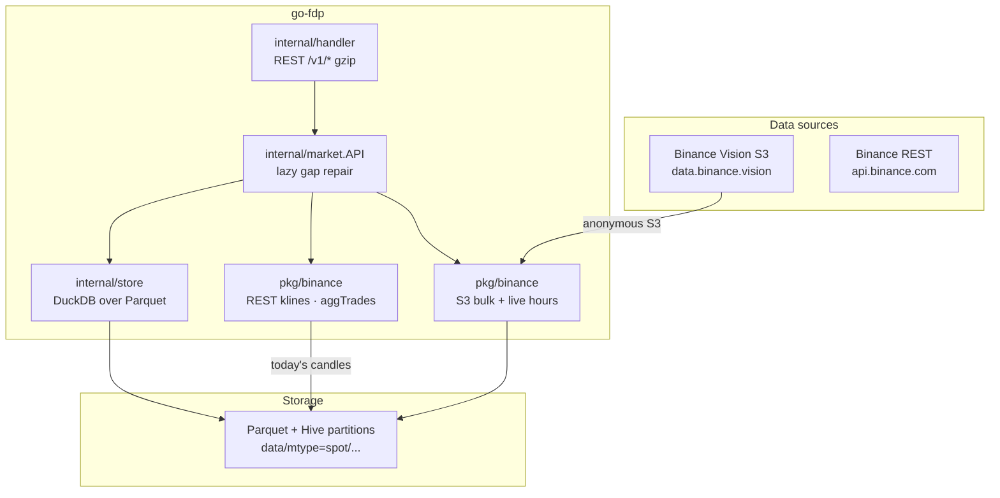
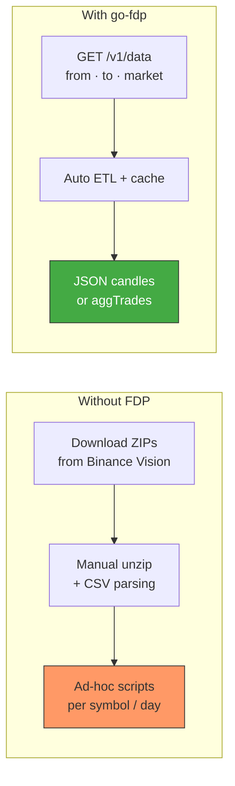

# go-fdp

[](https://pkg.go.dev/github.com/eslider/go-fdp)
[](https://opensource.org/licenses/MIT)
[](https://go.dev)
[](https://github.com/eSlider/go-fdp/stargazers)

Go **finance data proxy** for multi-exchange market data. **Binance** is the primary source today: download historical klines and aggregate trades from [Binance public data](https://data.binance.vision/), cache them as Hive-partitioned Parquet, query with DuckDB, and serve a gzip-compressed REST API. Additional sources (Bitfinex, Polymarket, …) plug in via `pkg/etl`. No API keys required for Binance historical S3 data.

Pairs with [go-trade](https://github.com/eSlider/go-trade) for a unified cross-exchange market data model.

## API documentation

Package reference (godoc): **[pkg.go.dev/github.com/eslider/go-fdp](https://pkg.go.dev/github.com/eslider/go-fdp)**

| Package                                                                     | Description                                      |
| --------------------------------------------------------------------------- | ------------------------------------------------ |
| [pkg/binance](https://pkg.go.dev/github.com/eslider/go-fdp/pkg/binance)     | Binance S3 ETL, live hourly Parquet, REST client |
| [pkg/etl](https://pkg.go.dev/github.com/eslider/go-fdp/pkg/etl)             | Multi-source bulk/live router                    |
| [pkg/data](https://pkg.go.dev/github.com/eslider/go-fdp/pkg/data)           | Parquet, CSV, shared types                       |
| [pkg/gapfill](https://pkg.go.dev/github.com/eslider/go-fdp/pkg/gapfill)     | Lazy gap repair on read                          |
| [pkg/integrity](https://pkg.go.dev/github.com/eslider/go-fdp/pkg/integrity) | Parquet audits and policies                      |

The former module path `github.com/eslider/go-binance-fdp` redirects here after the rename.

## Architecture



## The Problem: Raw Files vs. Queryable History



**Without a proxy:** You manage S3 paths, daily ZIP layouts, decompression, schema mapping, and missing “today” data yourself.

**With FDP:** Request a time range; the service fetches missing Parquet from S3 (or live API for the current day), runs DuckDB, and returns JSON.

## Features

| Feature               | Description                                                             |
| --------------------- | ----------------------------------------------------------------------- |
| **Historical klines** | Daily/monthly ZIPs from Binance Vision → Parquet                        |
| **Aggregate trades**  | Spot aggTrades with hourly Parquet for recent data                      |
| **ETL on demand**     | Downloads and transforms only missing partitions                        |
| **DuckDB cache**      | Fast range queries over local Parquet                                   |
| **Lazy gap repair**   | Count-first audit + repair on API read (`pkg/gapfill`, `pkg/integrity`) |
| **Live gap fill**     | Current-day klines via Binance REST (`pkg/binance`)                     |
| **REST API**          | Gzip-enabled JSON endpoints                                             |
| **Observability**     | Optional Grafana + Loki + Promtail via Docker Compose                   |

## Requirements

- Go 1.26+
- Network access to `data.binance.vision` (public S3) and `api.binance.com`
- CGO (DuckDB) — build with tag `no_duckdb_arrow`

## Installation

```bash
go get github.com/eslider/go-fdp
```

Clone and run the server:

```bash
git clone https://github.com/eSlider/go-fdp.git
cd go-fdp
go mod download
go run -tags no_duckdb_arrow ./cmd/fdp
```

Default listen port: **8082**.

### Docker

```bash
docker compose up --build
```

API: `http://localhost:8082` · Grafana: `http://localhost:3000` (anonymous admin in compose — **dev only**).

## Quick Start

### Historical klines

```bash
curl -G 'http://localhost:8082/v1/data' \
  --data-urlencode 'market=BTCUSDT' \
  --data-urlencode 'exchange=binance' \
  --data-urlencode 'marketType=spot' \
  --data-urlencode 'frame=1m' \
  --data-urlencode 'indicator=klines' \
  --data-urlencode 'from=1609459200000' \
  --data-urlencode 'to=1609545600000'
```

### Aggregate trades

```bash
curl -G 'http://localhost:8082/v1/aggtrades' \
  --data-urlencode 'market=BTCUSDT' \
  --data-urlencode 'from=1734048000000' \
  --data-urlencode 'to=1734134400000'
```

### Markets and symbols

```bash
curl 'http://localhost:8082/v1/markets'
curl 'http://localhost:8082/v1/symbols'
```

## ETL Flow


## Project Structure

```
├── cmd/
│   ├── fdp/                # HTTP server (finance data proxy)
│   ├── audit/              # Parquet integrity CLI
│   └── polymarket-import/  # Optional Polymarket bulk Parquet seed
├── internal/
│   ├── handler/            # REST handlers (/v1/*)
│   ├── market/             # Use cases: Candles, AggTrades, lazy repair
│   ├── query/              # Shared read types (store + market)
│   └── store/              # DuckDB reads over Parquet
├── pkg/
│   ├── binance/            # S3 ETL, REST client, live hourly seal
│   ├── polymarket/         # Gamma/CLOB predictions ETL and Parquet cache
│   ├── etl/                # Router, BulkLoader, LiveSeries
│   ├── gapfill/            # Lazy Repairer + hourplan
│   ├── integrity/          # Parquet audit + policy
│   ├── data/               # Parquet, CSV, drain helpers
│   └── fs/                 # File helpers
├── tools/                  # e.g. genpolymarketfixture for import smoke tests
├── docker/                 # Grafana, Loki, Promtail configs
├── compose.yml
└── data/                   # Local Parquet cache (gitignored)
```

## API Reference

### `GET /v1/data`

Historical OHLCV candles (klines).

| Query        | Required | Default   | Description                     |
| ------------ | -------- | --------- | ------------------------------- |
| `from`       | yes      | —         | Start time (Unix ms)            |
| `to`         | yes      | —         | End time (Unix ms)              |
| `market`     | yes      | —         | Symbol, e.g. `BTCUSDT`          |
| `exchange`   | no       | `binance` | Exchange id                     |
| `marketType` | no       | `spot`    | `spot`, `futures`, `options`    |
| `frame`      | no       | `1m`      | `1s`, `1m`, `5m`, `1h`, `1d`, … |
| `indicator`  | no       | `klines`  | `klines`                        |

### `GET /v1/aggtrades`

Compressed aggregate trades for a time range.

| Query        | Required | Default   | Description          |
| ------------ | -------- | --------- | -------------------- |
| `from`       | yes      | —         | Start time (Unix ms) |
| `to`         | yes      | —         | End time (Unix ms)   |
| `market`     | yes      | —         | Symbol               |
| `exchange`   | no       | `binance` | Exchange id          |
| `marketType` | no       | `spot`    | Market type          |

### `GET /v1/markets` · `GET /v1/symbols`

List known markets and tradable symbols (from cached metadata).

### `GET /v1/predictions`

Polymarket BTC Up/Down implied probability history (Hive Parquet cache, lazy CLOB backfill).

| Query      | Required | Default      | Description                   |
| ---------- | -------- | ------------ | ----------------------------- |
| `from`     | yes      | —            | Start time (Unix ms)          |
| `to`       | yes      | —            | End time (Unix ms)            |
| `market`   | no       | `BTCUSDT`    | Normalized symbol             |
| `exchange` | no       | `polymarket` | Source id                     |
| `frame`    | no       | `5m`         | `1m`, `5m`, `15m`, `1h`, `4h` |

```bash
curl -G 'http://localhost:8082/v1/predictions' \
  --data-urlencode 'market=BTCUSDT' \
  --data-urlencode 'frame=5m' \
  --data-urlencode 'from=1735689600000' \
  --data-urlencode 'to=1735776000000'
```

Background polling: `-polymarket-poll-interval=30s` (disable with `-polymarket-poll-disable`).

Bulk historical seed (optional):

- **HF** — directory of Parquet files already in FDP prediction row schema (see `go run ./tools/genpolymarketfixture` for a tiny sample under `testdata/polymarket/hf/`).
- **polydata** — CSV with `timestamp`/`ts`, `price`, `slug`/`event_slug` columns (`.csv.xz` not supported yet; decompress first).
- **api** — live Gamma + CLOB backfill into `data/` (rate-limited; a full calendar year can take many hours).

```bash
# Sample HF fixture → Parquet cache (fast)
go run ./tools/genpolymarketfixture
go run ./cmd/polymarket-import -source hf -data-dir ./testdata/polymarket/hf -year 2026 -market BTCUSDT -frame 5m

# Live backfill for 2026 YTD (omit -max-* for full days; each 5m day is ~288 API windows)
go run ./cmd/polymarket-import -source api -year 2026 -market BTCUSDT -frame 5m

# Smoke test (first day only, first 48 five-minute windows)
go run ./cmd/polymarket-import -source api -year 2026 -max-days 1 -max-windows 48 -market BTCUSDT -frame 5m
```

## Library Usage

### History consumer (S3 ETL)

```go
import (
    "context"
    "time"

    "github.com/eslider/go-fdp/pkg/binance"
    "github.com/eslider/go-fdp/pkg/data"
)

func main() {
    ctx := context.Background()
    consumer, err := binance.NewHistoryConsumer(ctx)
    if err != nil {
        panic(err)
    }

    asset := &binance.HistoryAsset{
        MarketType: binance.Spot,
        Frequency:  binance.Daily,
        Frame:      data.Minute,
        Indicator:  binance.Klines,
        Date:       time.Date(2024, 1, 1, 0, 0, 0, 0, time.UTC),
        Market:     "BTCUSDT",
    }

    _, err = consumer.DownloadAndTransform(ctx, asset)
    if err != nil {
        panic(err)
    }
}
```

### Binance REST client

```go
import (
    "context"
    "time"

    "github.com/eslider/go-fdp/pkg/binance"
)

func main() {
    ctx := context.Background()
    start := time.Now().Add(-time.Hour).UnixMilli()
    klines, err := binance.FetchKlines(ctx, &binance.KlineRequest{
        Base: binance.SymbolRequest{
            Symbol:    "BTCUSDT",
            StartTime: &start,
        },
        Interval: "1m",
        Limit:    60,
    })
    if err != nil {
        panic(err)
    }
    _ = klines
}
```

## Development

```bash
go mod tidy
go fmt ./...
go test -short -tags no_duckdb_arrow ./...
go test -tags no_duckdb_arrow ./...
go run -tags no_duckdb_arrow ./cmd/fdp -port 8082
go run -tags no_duckdb_arrow ./cmd/audit -today -market BTCUSDT
```

Tests use real parquet fixtures and optional live Binance calls — no generated mocks. Use `-short` to skip network-heavy cases in CI.

## Environment

No secrets are required for Binance Vision (anonymous S3) or public REST market data endpoints.

| Path / setting | Description                             |
| -------------- | --------------------------------------- |
| `./data/`      | Parquet cache root (created at runtime) |
| `-port`        | HTTP listen port (default `8082`)       |

## Related Projects

| Project                                                   | Description                                               |
| --------------------------------------------------------- | --------------------------------------------------------- |
| [go-trade](https://github.com/eSlider/go-trade)           | Unified candles, trades, and instruments across exchanges |
| [go-onlyoffice](https://github.com/eSlider/go-onlyoffice) | OnlyOffice PM API client                                  |

## License

[MIT](LICENSE)
